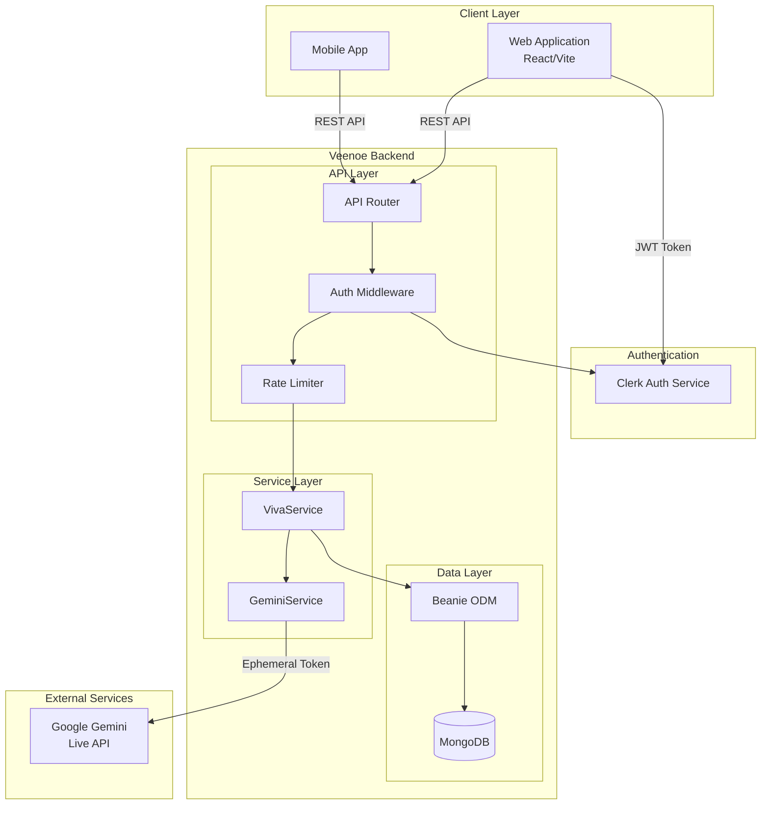
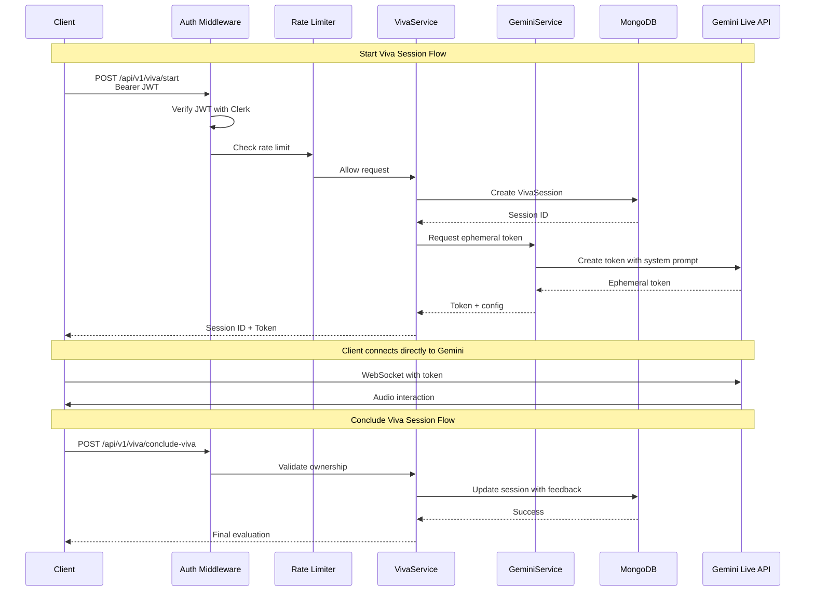
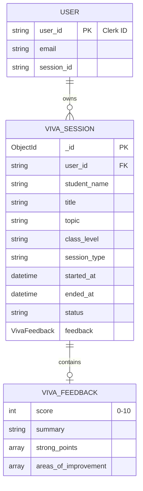
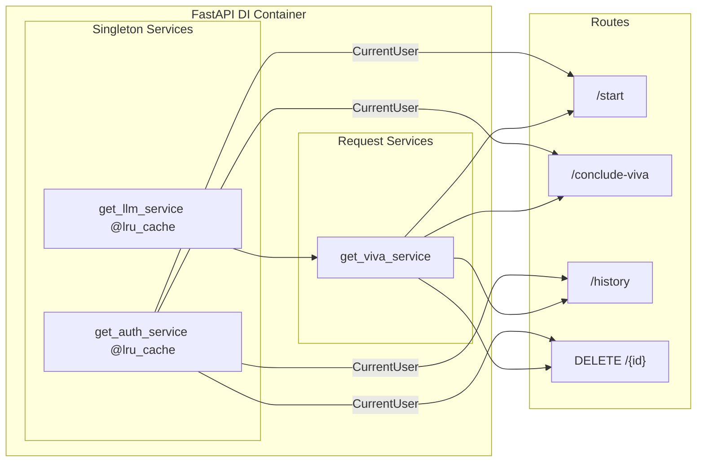

# Veenoe AI Viva Backend

<div align="center">


**AI-Powered Oral Examination Platform**

[Features](#-features) • [Architecture](#-architecture) • [Quick Start](#-quick-start) • [API Reference](#-api-reference) • [Deployment](#-deployment)

</div>

---

## Overview

Veenoe is a **SaaS backend** that powers AI-driven oral examinations (vivas) using Google's Gemini Live API. Built with first-principles thinking, it provides a scalable, secure, and maintainable foundation for educational assessment technology.

### Core Value Proposition

| Traditional Viva | Veenoe AI Viva |
|-----------------|----------------|
| Requires human examiner | Fully automated AI examiner |
| Limited scheduling flexibility | 24/7 availability |
| Subjective evaluation | Consistent, criteria-based scoring |
| Manual record-keeping | Automatic session archival |
| No detailed analytics | Structured feedback with insights |

---

## Features

### Core Capabilities

- **Real-Time AI Examinations**: WebSocket-based live audio interaction with Google Gemini 2.5
- **Dynamic Question Generation**: AI adapts questions based on student responses and difficulty level
- **Structured Evaluation**: Automated scoring (0-10) with detailed strengths and improvement areas
- **Session Management**: Full CRUD operations for viva sessions with ownership controls
- **Authentication**: Secure JWT-based auth via Clerk with role-based access

### Technical Highlights

- **Clean Architecture**: Strict separation between API, Service, and Data layers
- **Dependency Injection**: Fully testable, loosely-coupled component design
- **Rate Limiting**: Protection against API quota exhaustion and abuse
- **Health Checks**: Production-ready endpoints for load balancer integration
- **Graceful Shutdown**: Proper resource cleanup on application termination

---

## Architecture

### High-Level System Architecture



### Request Flow Diagram



### Data Model



### Project Structure

```
backend/
├── app/
│   ├── api/                    # API Layer (Controllers)
│   │   ├── api.py              # Main router aggregation
│   │   ├── deps.py             # Dependency injection bindings
│   │   └── v1/
│   │       └── viva.py         # Viva endpoints (v1)
│   │
│   ├── core/                   # Core Configuration
│   │   ├── config.py           # Environment settings
│   │   └── auth/
│   │       ├── __init__.py     # Public auth exports
│   │       ├── clerk.py        # Clerk auth implementation
│   │       └── dependencies.py # FastAPI auth dependencies
│   │
│   ├── db/                     # Data Layer
│   │   ├── database.py         # MongoDB connection management
│   │   └── models.py           # Beanie document models
│   │
│   ├── schemas/                # Request/Response DTOs
│   │   └── viva.py             # Viva Pydantic schemas
│   │
│   ├── services/               # Business Logic Layer
│   │   ├── viva_service.py     # Viva business logic
│   │   └── gemini_service.py   # Gemini API integration
│   │
│   ├── interfaces/             # Abstract contracts
│   │   └── llm_client.py       # LLM client protocol
│   │
│   └── main.py                 # Application entry point
│
├── scripts/                    # Utility scripts
├── .env                        # Environment variables
├── requirements.txt            # Python dependencies
├── vercel.json                 # Vercel deployment config
└── README.md                   # This file
```

### Dependency Injection Architecture



---

## Technology Stack

| Category | Technology | Purpose |
|----------|------------|---------|
| **Web Framework** | FastAPI 0.115+ | Async REST API with automatic OpenAPI docs |
| **Database** | MongoDB | Document storage for session data |
| **ODM** | Beanie | Async MongoDB object-document mapping |
| **AI/ML** | Google Gemini 2.5 Flash | Real-time audio conversation model |
| **Authentication** | Clerk | JWT-based identity management |
| **Rate Limiting** | SlowAPI | Request throttling and quota protection |
| **Validation** | Pydantic v2 | Schema validation and serialization |
| **ASGI Server** | Uvicorn | Production-grade async server |
| **Deployment** | Vercel | Serverless Python hosting |

---

## Quick Start

### Prerequisites

- Python 3.11 or higher
- MongoDB Atlas account (or local MongoDB)
- Google AI Studio API key
- Clerk account for authentication

### Installation

1. **Clone and setup virtual environment**
   ```bash
   git clone <repository-url>
   cd backend
   python -m venv .venv
   
   # Windows
   .venv\Scripts\activate
   
   # Unix/macOS
   source .venv/bin/activate
   ```

2. **Install dependencies**
   ```bash
   pip install -r requirements.txt
   ```

3. **Configure environment variables**
   ```bash
   cp .env.example .env
   ```
   
   Edit `.env` with your credentials:
   ```env
   # MongoDB
   MONGO_URI=mongodb+srv://<user>:<password>@cluster.mongodb.net/
   MONGO_DB_NAME=veenoe_prod
   
   # Google AI
   GOOGLE_API_KEY=your_google_ai_studio_key
   
   # Clerk Authentication
   CLERK_SECRET_KEY=sk_test_xxxxxxxxxxxx
   
   # Optional
   FRONTEND_URL=https://your-frontend.com
   CORS_ORIGINS=https://app1.com,https://app2.com
   ```

4. **Run the server**
   ```bash
   # Development with hot reload
   uvicorn app.main:app --reload --port 8000
   
   # Production
   uvicorn app.main:app --host 0.0.0.0 --port 8000
   ```

5. **Verify installation**
   ```bash
   curl http://localhost:8000/health
   # Expected: {"status":"healthy","database":"connected"}
   ```

---

## API Reference

### Authentication

All endpoints (except `/health` and public session details) require a valid JWT token:

```http
Authorization: Bearer <clerk_jwt_token>
```

### Base URL

```
Production: https://api.veenoe.com
Development: http://localhost:8000
```

### Endpoints

#### Start Viva Session

```http
POST /api/v1/viva/start
Content-Type: application/json
Authorization: Bearer <token>

{
  "student_name": "John Doe",
  "topic": "Python Programming",
  "class_level": "12",
  "session_type": "viva",
  "voice_name": "Kore"
}
```

**Response:**
```json
{
  "viva_session_id": "507f1f77bcf86cd799439011",
  "ephemeral_token": "projects/.../tokens/...",
  "google_model": "gemini-2.5-flash-native-audio-preview-09-2025",
  "session_duration_minutes": 5,
  "voice_name": "Kore"
}
```

#### Conclude Viva Session

```http
POST /api/v1/viva/conclude-viva
Authorization: Bearer <token>

{
  "viva_session_id": "507f1f77bcf86cd799439011",
  "score": 8,
  "summary": "Strong understanding of Python fundamentals...",
  "strong_points": ["Variables", "Loops", "Functions"],
  "areas_of_improvement": ["Object-oriented concepts", "Error handling"]
}
```

#### Get User History

```http
GET /api/v1/viva/history
Authorization: Bearer <token>
```

#### Get Session Details

```http
GET /api/v1/viva/{session_id}
```

#### Rename Session

```http
PATCH /api/v1/viva/{session_id}/rename
Authorization: Bearer <token>

{
  "new_title": "Advanced Python Viva"
}
```

#### Delete Session

```http
DELETE /api/v1/viva/{session_id}
Authorization: Bearer <token>
```

### Rate Limits

| Endpoint | Limit |
|----------|-------|
| `/start` | 5 requests/minute |
| Others | Standard limits |

---

## Design Decisions

### First Principles Thinking

This codebase follows key architectural principles derived from first principles:

```mermaid
graph TB
    ROOT((Design<br/>Principles))
    
    ROOT --> SEC[Security]
    ROOT --> SCA[Scalability]
    ROOT --> MAI[Maintainability]
    ROOT --> REL[Reliability]
    
    SEC --> SEC1[JWT-based auth]
    SEC --> SEC2[Server-side user identity]
    SEC --> SEC3[Ephemeral tokens]
    SEC --> SEC4[Ownership validation]
    
    SCA --> SCA1[Async I/O throughout]
    SCA --> SCA2[Connection pooling]
    SCA --> SCA3[Stateless services]
    SCA --> SCA4[Singleton clients]
    
    MAI --> MAI1[Clean architecture]
    MAI --> MAI2[Dependency injection]
    MAI --> MAI3[Protocol-based interfaces]
    MAI --> MAI4[Comprehensive logging]
    
    REL --> REL1[Graceful shutdown]
    REL --> REL2[Health endpoints]
    REL --> REL3[Rate limiting]
    REL --> REL4[Error handling]
    
    style ROOT fill:#4285f4,color:#fff
    style SEC fill:#34a853,color:#fff
    style SCA fill:#ea4335,color:#fff
    style MAI fill:#fbbc04,color:#fff
    style REL fill:#9c27b0,color:#fff
```



### Key Architectural Decisions

| Decision | Rationale |
|----------|-----------|
| **Protocol-based LLM Interface** | Enables hot-swapping AI providers without business logic changes |
| **Service Layer Pattern** | Isolates business logic from HTTP transport, enabling reuse and testing |
| **Clerk Authentication** | Enterprise-grade auth with minimal implementation overhead |
| **MongoDB + Beanie** | Flexible schema for evolving session data with type-safe ODM |
| **Ephemeral Tokens** | Client connects directly to Gemini without exposing API keys |
| **User ID from JWT Only** | Prevents identity spoofing; server is single source of truth |

---

## Security Considerations

| Threat | Mitigation |
|--------|------------|
| API Key Exposure | Keys stored server-side; ephemeral tokens for client |
| Identity Spoofing | User ID extracted from verified JWT only |
| Rate Limit Bypass | IP-based limiting with SlowAPI |
| Session Hijacking | Ownership validation on all mutations |
| Database Injection | Beanie ODM with parameterized queries |

---

<div align="center">

Follow me on X: **[@kaushalkrsna](https://x.com/kaushalkrsna)**

</div>
